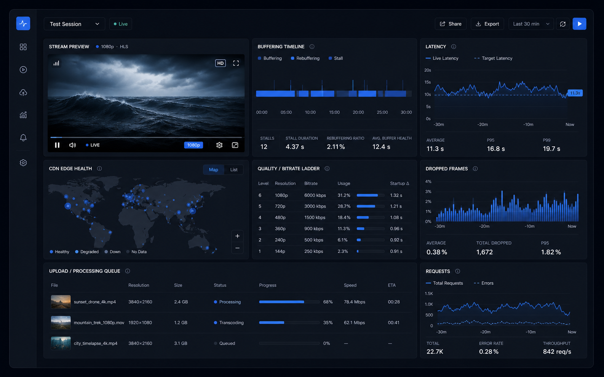

# buffer.lol

Fast, simple browser-based tools for network diagnostics, web checks, and everyday developer utilities.



buffer.lol is a focused toolbox for checking hosts, domains, headers, certificates, IP metadata, and common data formats without accounts, dashboards, or clutter. Browser-safe utilities run locally in the user's tab; live network diagnostics go through a same-origin Next.js API with rate limiting, request deduplication, SSRF protections, and short-lived caching where it is safe.

## What It Includes

- Network checks for DNS records, HTTP headers, TLS certificates, uptime, TCP ports, redirects, robots.txt, sitemaps, and RDAP-backed WHOIS data.
- IP utilities for public IP detection, network/geolocation estimates, ASN lookups, and browser user-agent signals.
- Local developer tools for JSON formatting, Base64, hashing, UUIDs, timestamps, URL parsing, JWT decoding, regex testing, and CIDR calculations.
- A central tool registry that powers landing cards, dynamic tool pages, and API-backed experiences.
- Mintlify documentation in `docs/` for the hosted docs site.
- Production hardening for same-origin requests, body-size limits, rate limits, private-network target blocking, live request deduplication, concurrency caps, and optional worker-backed ICMP tools.

## Tool Catalog

| Category | Tools |
| --- | --- |
| Networking | Ping, packet loss, traceroute, DNS lookup, HTTP headers, SSL certificate checker, uptime checker, port checker, CIDR calculator, WHOIS/RDAP lookup, redirect checker, robots.txt/sitemap checker |
| IP | What's my IP, IP geolocation, ASN/ISP lookup, user-agent parser |
| Developer | JSON formatter, Base64 encoder/decoder, hash generator, UUID generator, timestamp converter, URL parser/encoder, JWT decoder, regex tester |

Ping, packet-loss, and traceroute require an optional diagnostics worker because ICMP and route tracing are not reliable in typical serverless runtimes. The public API shape stays the same when the worker is enabled.

## Tech Stack

- Next.js App Router
- React 18
- TypeScript
- Node.js API routes
- Mintlify docs
- Netlify deployment configuration

## Getting Started

```bash
npm install
npm run dev
```

Open `http://localhost:3000`.

To preview the docs:

```bash
npm run docs:dev
```

The docs preview runs from `docs/` on `http://localhost:3333`.

## Scripts

| Command | Description |
| --- | --- |
| `npm run dev` | Start the local Next.js app. |
| `npm run build` | Build the production app. |
| `npm run lint` | Run ESLint for `app` and `components`. |
| `npm run typecheck` | Run TypeScript without emitting files. |
| `npm run docs:dev` | Start the local Mintlify docs preview. |

## Environment

No environment variables are required for local development.

Copy `.env.example` to `.env.local` when configuring production-like behavior:

| Variable | Required | Description |
| --- | --- | --- |
| `NEXT_PUBLIC_DOCS_URL` | No | Docs URL used by the app. Leave empty locally or set to `https://docs.buffer.lol` when the docs subdomain is live. |
| `UPSTASH_REDIS_REST_URL` | No | Enables shared Redis-backed API rate limiting when paired with the token. |
| `UPSTASH_REDIS_REST_TOKEN` | No | Upstash REST token for shared rate limiting. |
| `TRUST_PROXY_HEADERS` | No | Set to `true` only when the deployment platform provides trusted forwarding headers. |
| `TRUSTED_PROXY_PLATFORM` | No | Alternative proxy preset: `vercel`, `netlify`, or `cloudflare`. |
| `ENABLE_WORKER_TOOLS` | No | Enables worker-backed ping, packet-loss, and traceroute tools. |
| `DIAGNOSTICS_WORKER_URL` | No | Base URL for the diagnostics worker. Required when worker tools are enabled. |
| `DIAGNOSTICS_WORKER_TOKEN` | No | Optional bearer token sent to the diagnostics worker. |
| `DIAGNOSTICS_MAX_CONCURRENCY` | No | Per-instance cap for live diagnostics work. Defaults to the app fallback when unset. |

## API

Server-backed tools use a shared endpoint:

```http
POST /api/tools/[slug]
Content-Type: application/json
```

Request body:

```json
{
  "input": "example.com"
}
```

Response envelope:

```json
{
  "data": {},
  "durationMs": 42,
  "requestId": "00000000-0000-4000-8000-000000000000"
}
```

Errors use the same envelope:

```json
{
  "error": "Too many requests. Please slow down and try again shortly.",
  "durationMs": 4,
  "requestId": "00000000-0000-4000-8000-000000000000"
}
```

The route accepts same-origin POST requests, rejects oversized bodies, rate limits by client and target, deduplicates identical in-flight work, blocks private or reserved outbound targets, and caches DNS, RDAP, and ASN results briefly where appropriate.

## Project Structure

```text
app/                  Next.js routes, metadata, legal pages, and API handlers
components/           Landing page and reusable tool UI components
data/tools.ts         Tool registry used by cards, pages, and API-backed flows
docs/                 Mintlify documentation project
public/assets/        Public static assets
assets/               README and project media
```

## Deployment

The repository includes `netlify.toml` with the production build command, publish directory, cache headers, and baseline security headers. The app can also run on any platform that supports Next.js App Router with the Node.js runtime for API routes.

Before publishing, run:

```bash
npm run lint
npm run typecheck
npm run build
```

## Privacy And Safety

- Browser utilities process data locally whenever possible.
- Network diagnostics are explicit server-backed requests to public targets.
- The API blocks private and reserved outbound network targets to reduce SSRF risk.
- Rate limiting and request deduplication protect the service from accidental bursts.
- Proxy IP headers are ignored unless explicitly trusted through environment configuration.

## License

Copyright (c) 2026 buffer.lol.

This source is provided for review and deployment of buffer.lol only. See [LICENSE](LICENSE) for the full terms.
